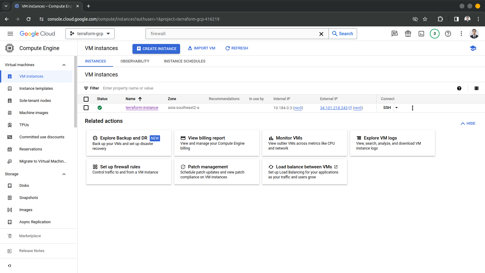
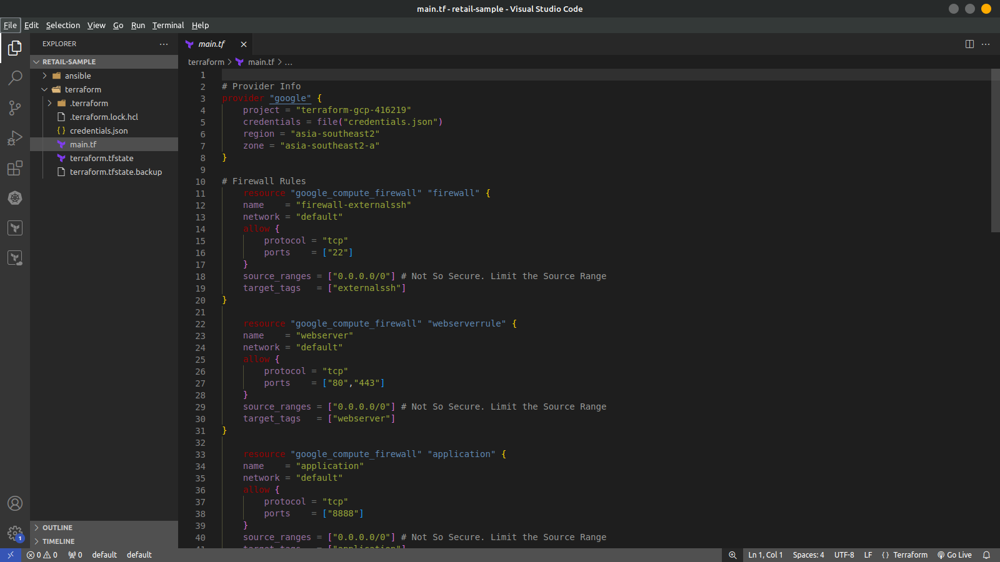
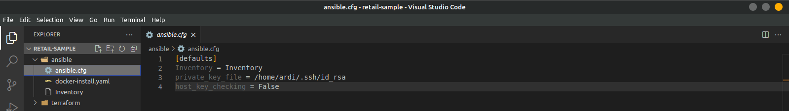
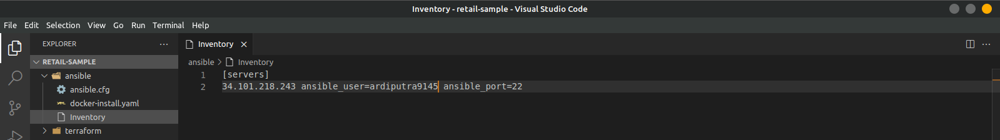

## Provisioning


#### Requirement 
- Local machine w/ Ansible & Terraform
- Google Cloud Platform Server

1. Menyiapkan *Virtual Machine* menggunakan terraform yang akan digunakan untuk melakukan deployment aplikasi. 
   
    
    Membuat file `main.tf` kemudian memasukan script di bawah ini
   ```
    # Provider Info
    provider "google" {
        project = "terraform-gcp-416219"
        credentials = file("credentials.json")
        region = "asia-southeast2"
        zone = "asia-southeast2-a"
    }

    # Firewall Rules
        resource "google_compute_firewall" "firewall" {
        name    = "firewall-externalssh"
        network = "default"
        allow {
            protocol = "tcp"
            ports    = ["22"]
        }
        source_ranges = ["0.0.0.0/0"] 
        target_tags   = ["externalssh"]
    }

        resource "google_compute_firewall" "webserverrule" {
        name    = "webserver"
        network = "default"
        allow {
            protocol = "tcp"
            ports    = ["80","443"]
        }
        source_ranges = ["0.0.0.0/0"] 
        target_tags   = ["webserver"]
    }

        resource "google_compute_firewall" "application" {
        name    = "application"
        network = "default"
        allow {
            protocol = "tcp"
            ports    = ["8888"]
        }
        source_ranges = ["0.0.0.0/0"] 
        target_tags   = ["application"]
    }

    # Instance Info
        resource "google_compute_address" "static" {
    name = "vm-public-address"
    project = "terraform-gcp-416219"
    region = "asia-southeast2"
    depends_on = [ google_compute_firewall.firewall ]
    }
        
        resource "google_compute_instance" "instance-1" {
        name = "terraform-instance"
        machine_type = "e2-medium"
        zone = "asia-southeast2-a"
        allow_stopping_for_update = true

        boot_disk {
            initialize_params {
            image = "ubuntu-os-cloud/ubuntu-2004-lts"
            }
        }
        
        network_interface {
            network = "default"
            access_config {
            nat_ip = google_compute_address.static.address
            }
        }

    # Ensure firewall rule is provisioned before server, so SSH doesn't fail.
        depends_on = [ google_compute_firewall.firewall, google_compute_firewall.webserverrule ]
        metadata_startup_script = "echo 'root:password' | chpasswd;echo 'PasswordAuthentication yes' >> /etc/ssh/sshd_config;echo 'PermitRootLogin yes' >>  /etc/ssh/sshd_config"
    }
        
        output "ad_ip_address" {
        value = google_compute_address.static.address
    }

   ```

2. Melakukan instalasi docker menggunakan ansible dengan membuat file ansible.cfg yang berisi file ssh key dan Inventory untuk keterangan user
    
    
   Membuat file docker-install.yaml dan masukan script berikut
   ```
    - hosts: servers
    become: true
    tasks:
    
        - name: Download Docker installation script
        shell: "curl -fsSL https://get.docker.com -o get-docker.sh"
        args:
            creates: get-docker.sh  # Memeriksa apakah skrip sudah ada sebelumnya

        - name: Run Docker installation script
        shell: "sh get-docker.sh"
        args:
            chdir: /home/ardiputra9145 # Menggunakan direktori playbook sebagai direktori kerja
        when: "get-docker.sh.stdout.find('Docker version') == -1"  # Memeriksa apakah Docker sudah terinstal

        - name: Add user to docker group
        user:
            name: "{{ ansible_user }}"
            groups: docker
            append: yes

        - name: Remove Docker installation script
        file:
            path: /home/ardiputra9145/get-docker.sh"
            state: absent

   ```
