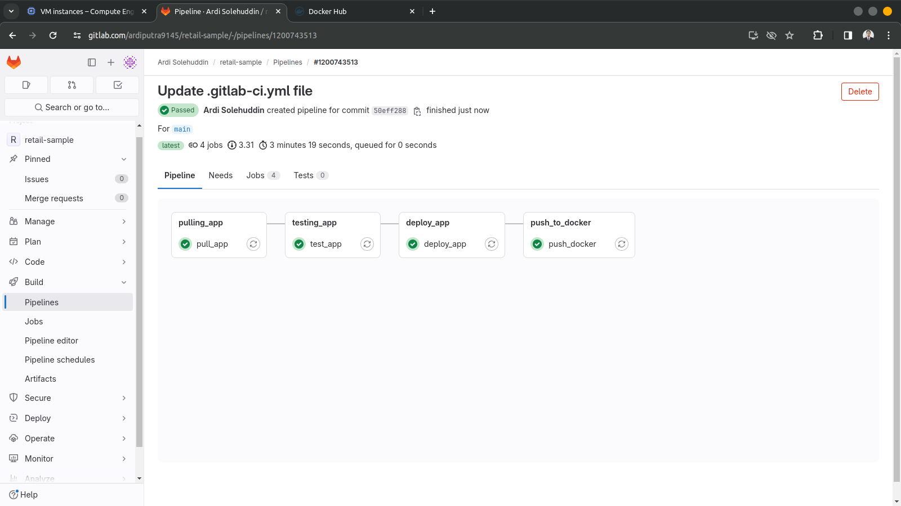
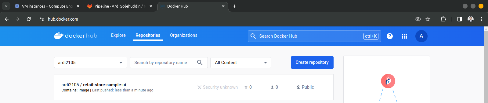

## CICD

Pada CICD saya menggunakan gitlab pipeline di mana nantinya ketika terdapat perubahan pada source code, secara otomatis akan mentrigger pipeline.

Berhasil melakukan push image ke docker hub
