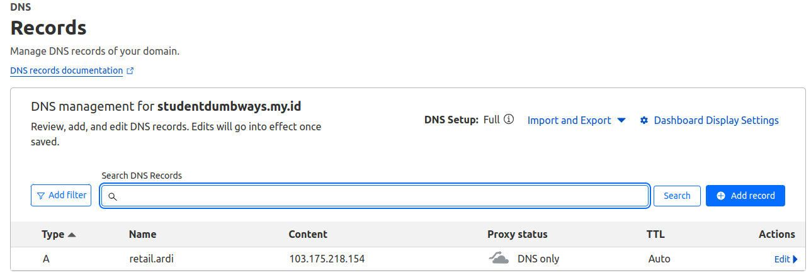
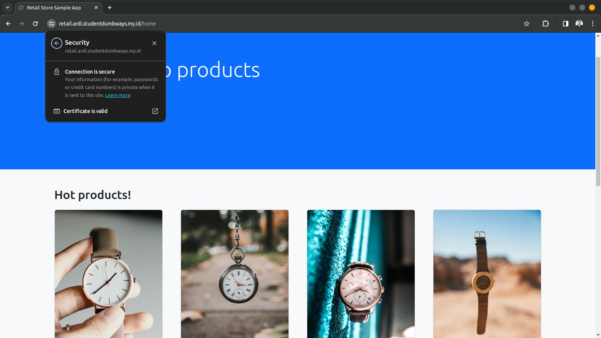

## Webserver

1. Untuk web server saya menggunakan server dari biznet di mana webserver yang digunakan adalah nginx, letsencrypt untuk SSL Certificate serta cloudflare untuk DNS. Membuat file docker compose untuk nginx dan certbot.
   ```
    version: '3.8'
    services:

    certbot:
        container_name: certbot
        image: certbot/dns-cloudflare
        volumes:
        - ~/certbot:/etc/letsencrypt
        - ~/.secrets/cloudflare.ini:/etc/letsencrypt/cloudflare.ini
        environment:
        - CERTBOT_DOMAIN=*.ardi.studentdumbways.my.id
        - CERTBOT_EMAIL=ardiputra9145@gmail.com
        command: certonly --dns-cloudflare --dns-cloudflare-credentials /etc/letsencrypt/cloudflare.ini --agree-tos --email ardiputra9145@gmail.com -d ardi.studentdumbways.my.id,*.ardi.studentdumbways.my.id --force-renewal

    nginx:
        container_name: nginx
        image: nginx:alpine
        ports:
        - "80:80"
        - "443:443"
        volumes:
        - ./nginx:/etc/nginx/conf.d
        - ./certbot:/etc/letsencrypt
        - ./scripts:/scripts
        depends_on:
        - certbot
        command: ["/bin/sh", "/scripts/startup.sh"]

    docker-registry:
        container_name: docker-registry
        image: registry:latest
        ports:
        - "5000:5000"
        restart: always
        environment:
        REGISTRY_AUTH: htpasswd
        REGISTRY_AUTH_HTPASSWD_REALM: Registry Realm
        REGISTRY_AUTH_HTPASSWD_PATH: ./auth
        REGISTRY_STORAGE_FILESYSTEM_ROOTDIRECTORY: /data
        volumes:
        - ./Registry/registry-data:/data
        - ./auth:/auth
   ```

2. Membuat file retail.conf yang berisi script reverse proxy aplikasi serta menambahkan dns pada cloudflare
   ```
        server {
            listen 80;
            listen 443 ssl;
            server_name retail.ardi.studentdumbways.my.id;

            ssl_certificate /etc/letsencrypt/live/ardi.studentdumbways.my.id/fullchain.pem;
            ssl_certificate_key /etc/letsencrypt/live/ardi.studentdumbways.my.id/privkey.pem;

            location / {
                    proxy_pass http://34.101.218.243:8888;
            proxy_set_header Host $host;
                    proxy_set_header X-Real-IP $remote_addr;
            }
    }
   ```
    

3. Aplikasi dapat diakses menggunakan dns serta dengan HTTPS.
    